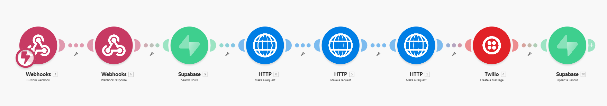

# Luxury AI Stylist - WhatsApp Concierge

An enterprise-grade, agentic AI stylist built to operate over WhatsApp. This system serves as a highly intelligent, proactive luxury concierge that understands user intent, performs live web searches for product matching, and curates highly personalized, formatted responses using advanced LLM pipelines.

## Features
- **WhatsApp Integration**: Seamlessly communicates via the Twilio WhatsApp API.
- **Multimodal Capable**: Designed to process both text and images.
- **Persistent Memory**: Uses Supabase to store chronological chat histories, allowing the agent to remember user preferences and past conversations.
- **Agentic Search**: Employs an LLM-based pre-processor to convert vague user moods or requests into precise e-commerce search queries.
- **Live Web Scraping**: Integrates with the Tavily Search API to scrape live product data and image URLs directly from the official website.
- **Strict Brand Persona**: Powered by Groq (Llama 3.3 70B), the agent strictly adheres to a luxurious, consultative brand voice while remaining within Twilio's text length constraints.
- **Zero-Timeout Architecture**: Utilizes asynchronous Webhook Responses to prevent third-party platform timeouts during extended search operations.

## Architecture (Make.com)

This system is completely serverless and orchestrated via Make.com using a highly robust 8-step pipeline:

1. **Twilio Webhook**: Listens 24/7 for incoming WhatsApp messages and media.
2. **Webhook Response (200 OK)**: Instantly replies with an empty XML `<Response></Response>` to Twilio, preventing timeouts.
3. **Supabase (Search Rows)**: Queries the database using the user's phone number to retrieve chronological past chat history.
4. **Groq Pre-Processor (Llama-3.3-70b)**: Ingests the user's memory and raw input to extract 2-4 highly targeted eCommerce search keywords.
5. **Tavily Search API**: Executes a targeted site-search (`site:us.louisvuitton.com [Keywords]`) to fetch live product links and image CDNs.
6. **Groq Curating Engine**: Selects the optimal product from the raw JSON search results and curates a luxurious response.
7. **Twilio Push**: Delivers the final formatted payload back to the user's WhatsApp.
8. **Supabase (Upsert Row)**: Appends a timestamped log of the new interaction to the user's database file for future recall.

## Deployment Guide

### Prerequisites
- Make.com Account (Free Tier suitable)
- Twilio Account + WhatsApp Sandbox Activated (Free Trial)
- GroqCloud API Key (Free)
- Tavily Search API Key (Free)

### Setup Instructions
1. **Import Blueprint**: Import the `blueprint.json` file into a new Make.com scenario.
2. **Configure Twilio**: 
   - Connect your Twilio webhook in the first module.
   - Ensure the "Webhook Response" module immediately follows it with `text/xml` headers and empty `<Response>` body.
3. **Configure Supabase (Search)**:
   - Connect your Supabase project using the Secret API Key.
   - Set table to `chat_history` and filter by the Twilio `From` phone number.
4. **Configure Groq (Pre-Processor)**:
   - Insert your Groq API Key and use the `llama-3.3-70b-versatile` model.
   - Ensure the Supabase `conversation_summary` is fed into the System Prompt.
5. **Configure Tavily**:
   - Insert your Tavily API Key.
   - Map the `message.content` from the Groq Pre-Processor into the search query.
6. **Configure Groq (Curator)**:
   - Insert your Groq API Key.
   - Map the `results[]` array from Tavily into the system prompt's Live Search Data section.
7. **Configure Twilio & Supabase (Upsert)**:
   - Configure the Twilio module to send the Groq Curator message to the user.
   - Configure the final Supabase module to append the new message to the existing `conversation_summary` with a timestamp.

## Future Roadmap
- **Autonomous Booking**: Integrating scheduling APIs to allow the agent to book in-store appointments autonomously based on real-time availability.
